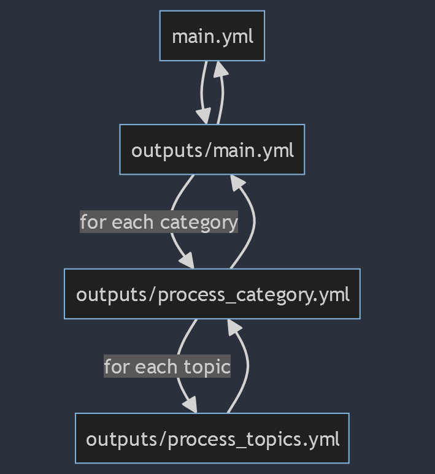
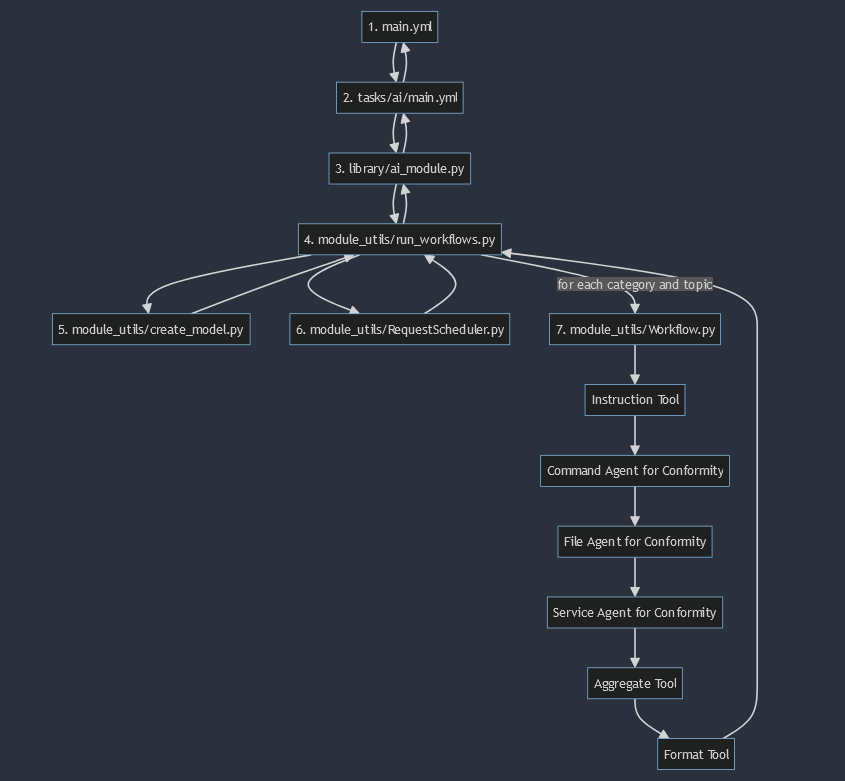
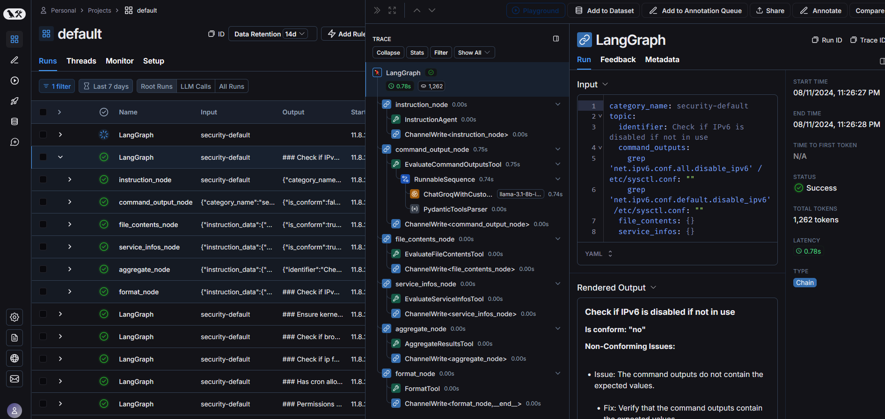

# evaluation-tool
The evaluation-tool is an Ansible role that does two things:
1) Get information from managed nodes
2) Ask LLM to evaluate if information is conforming to best practices

In this `README.md` its documented how this role works, how to debug and how to make changes to the existing code for future changes.
## Directory structure
```
├── README.md
├── defaults
│   └── main.yml                  (3)
├── flowchart_data_gathering.png
├── library                       (2)
│   └── ai_module.py               "
├── module_utils                   "
│   ├── RequestScheduler.py        "
│   ├── Workflow.py                "
│   ├── create_model.py            "
│   └── run_workflows.py           "
├── tasks
│   ├── ai                         "
│   │   └── main.yml               "
│   ├── main.yml
│   └── outputs                   (1)
│       ├── main.yml               "
│       ├── process_category.yml   "
│       ├── process_topics.yml     "
│       └── template.j2            "
└── vars                          
    ├── category_config.yml       (1) 
    ├── llm_config.yml            (2)
    └── test_category_config.yml   

```
## Get information from managed nodes (1)
This part of the Ansible role automates the processing of categories and topics, gathering information from managed nodes, 
running commands, and generating reports. It is structured to include configurations for categories and language models (LLM), 
and it processes each category to produce a final aggregated report in JSON format.

### Flowchart


### Files and Structure
* `main.yml`: The entry point of the role, setting up configurations, and invoking tasks.
* `vars/category_config.yml`: The configuration for the different files, commands and services we want to fetch from the managed nodes.
* `outputs/main.yml`: Handles initialization of reports and processing of each category.
* `outputs/process_category.yml`: Manages processing of topics within a category.
* `outputs/process_topics.yml`: Gathers data related to topics by fetching files, executing commands, and checking service statuses.
* `outputs/template.j2`: Jinja2 template used to format the final report output.

### How It Works

* **Setup Configuration**:\
Configure the different categories one wants to run against the managed nodes.
```yml
category_configuration:
  categories:
    - category_id: "category identifier"
      topics:
        - identifier: "Small description to describe the topic we want to validate conformity"
          files: [ "0 to n filename as a list", "filename2" ...]
          commands: [ "0 to n commands to run as a list", "command2" ...]
          services: [ "0 to n service names to check", "service2" ... ]
```

* **Process Categories**:\
Invokes `outputs/main.yml` to initialize the report and process each category.

* **Process Topics**:\
For each topic within a category, `outputs/process_topics.yml` fetches files, executes commands, and gathers service information.

* **Generate Reports**:\
    Collects data across all categories and formats it using `outputs/template.j2`.

### How to make changes
* **Adding/Removing Categories**:Update vars/category_config.yml.
* **Changing Output Formats**: Modify outputs/template.j2 to adjust the JSON output structure.
* **Updating Tasks**: Adjust tasks within `main.yml`, `outputs/main.yml`, `outputs/process_category.yml`, and `outputs/process_topics.yml`.


### Debugging
1) Run playbook with detailed logging: `ansible-playbook main.yml -vvv`
2) Enable suppressed detailed logging: Search and replace `no_log: true` with `no_log: false` in project
3) Add debug prints inside the faulting yml file:
```yml
- name: Print certain variable that doesn't do/ hold what it should
  debug:
    var: some_variable
```
4) Command, File and Service errors are weaved through to be more robust, check the json report in the end `../../evaluation-results/outputs/node-identifier-report.json`, in there its written what exactly failed. Just search for the identifier configured in `vars/category_config.yml`

Its tedious but it works :)

## AI Module (2)
### Flowchart

### Files and Structure

* `main.yml`: The entry point of the role, loading LLM configurations, and invoking evaluation tasks.
* `vars/llm_config.yml`: Configuration for the language model used for evaluations.
* `tasks/ai/main.yml`: Processes the information through LLM and generates evaluation results.
* `library/ai_module.py`: Custom Ansible module for running AI evaluations.
* `module_utils/run_workflows.py`: Handles the execution of workflows using LLMs.
* `module_utils/create_model.py`: Creates chat models from configuration for different LLMs.
* `module_utils/RequestScheduler.py`: Manages request scheduling and rate limits for LLMs.
* `module_utils/Workflow.py`: Defines the workflow for evaluating and aggregating results.

### How It Works

* **Uses configured models from `vars/llm_config.yml`**:\
defaults to groq-llama3.1 8B or whatever is passed as `--extra-vars "llm_name='xyModel'"` if its supported
* **Process Reports and Run AI**:\
Invokes` tasks/ai/main.yml` to process the JSON reports and run AI workflows for evaluation.

* **Run AI Workflows**:\
`library/ai_module.py` executes workflows using the selected LLM configuration to evaluate best practices and compliance.

* **Generate Evaluation Reports**:\
Aggregates insights and recommendations across all categories and formats them into Markdown reports.

### How to make changes
* **Add new model support**:
  * Configure a new langauge model in `vars/llm_config.yml`. 
  * Update `module_utils/create_models.py` to handle the new key from the llm config.
  * If it's a completely new key in the `vars/llm_config.yml`, then you have to check langchain if they have an abstraction for the ChatModel of your choice. ([Example for OpenAi](https://python.langchain.com/v0.2/docs/integrations/chat/openai/). You should look for the Chat implementation of the model, as the older ones do NOT have adequate tool support.
  * If you want to support multiple models under the same key (like groq), then you can refer to how groq is implemented.

* **Adjusting Workflow logic**:
  * Edit `module-utils/Workflow.py` to modify how evaluations are conducted.
  * Or create your own implementation of a `Workflow_xy.py`, best is to first inspect `Workflow.py` starting from the method `create_graph`
    * Start at the `create_graph` method.
    * Create method for your workflow (prompts, formatting, etc.)
    * Create StructuredTools for your method, like this: 
      ```py
      aggregation_tool = StructuredTool.from_function(
          coroutine=self.async_methods_are_coroutines,
          # args_schema=StateSchema, if you work with structured output
          name="Name of your fancy async Tool",
          description="Description of your fancy async tool"
      )
      format_tool = StructuredTool.from_function(
          func=self.sync_methods_are_funcs,
          # args_schema=StateSchema, if you work with structured output
          name="Name of your fancy sync Tool",
          description="Description of your fancy sync tool"
      )
      ```
    * Add the tool as a node to the graph (see `create_graph` or linked tutorial below)
    * Test before adding new nodes... (see below for description to debug LangGraph constructs properly)
    * Test with different models, because different models handle input/ output differently

* **Customizing output format**:\
  * Update `format_to_md` method in existing Workflow
  * Update pydantic types (they have builtin validation and are used for structured output) at the top of the file and then `format_to_md`
    * Example for a pydantic type (line 22-65 in `Workflow.py`):
      ```py
      class EvaluationResult(BaseModel):
          is_conform: bool = Field(description="Indicates if the input conforms to best practices")
          non_conforming_issues: List[NonConformingIssue] = Field(default_factory=list)
          identifier: str = Field(default="", description="The identifier for the topic")

      ```
And here a list of useful links to understand LangChain and LangGraph better for our implementation:
* [LangGraph Docs](https://langchain-ai.github.io/langgraph/)
* [LangGraph How To Guides (those are amazing to get started)](https://langchain-ai.github.io/langgraph/how-tos/)
* [LangChain Chat Models Docs](https://python.langchain.com/v0.2/docs/integrations/chat/)
* [How to return structured output](https://python.langchain.com/v0.2/docs/how_to/structured_output/)

### Debugging
1) First and foremost, setup LangSmith environment, as this is the main tool we use to manually evaluate the Workflow.
   * [Create an API Key for LangSmith](https://smith.langchain.com/settings)
   * Create Environment Variables
      ```
      export LANGCHAIN_TRACING_V2=true
      export LANGCHAIN_API_KEY=<YOUR-API-KEY-FROM-ABOVE>
      ```
    * Now each time the workflow is run, LangSmith tracks it. Neat!
    * Navigate to [LangSmith](https://smith.langchain.com/), then click on Projects, then the default one and there you see your runs. And it looks like this:
    
    * Individual workflows can be analyzed manually this way. You can see what input of the different steps are, how the llm rendered the output, token count, price, etc. It's a great tool.
2) Run playbook with detailed logging: `ansible-playbook main.yml -vvv`

## Changing output directory structure, node names or report file names (3)
All of those values are configured in `defaults/main.yml` and can be changed anytime without touching any other code.
* If you want to change the output directory structure, change any of the following values:
  ```yml
  base_dir: "{{ playbook_dir }}/evaluation-results"
  outputs_base_dir: "{{ base_dir }}/outputs"
  final_reports_base_dir: "{{ base_dir }}/reports"
  ```
* If you want to change the node name
  ```yml
  node_name: "{{ group_names[2] }}-{{ group_names[0] }}-{{ openstack.name }}"
  ```
* If you want to change the report file names
  ```
  outputs_reports_file: "{{ outputs_base_dir }}/{{ node_name }}-report.json"
  final_reports_file: "{{ final_reports_base_dir }}/{{ node_name }}-report.json"
  ```